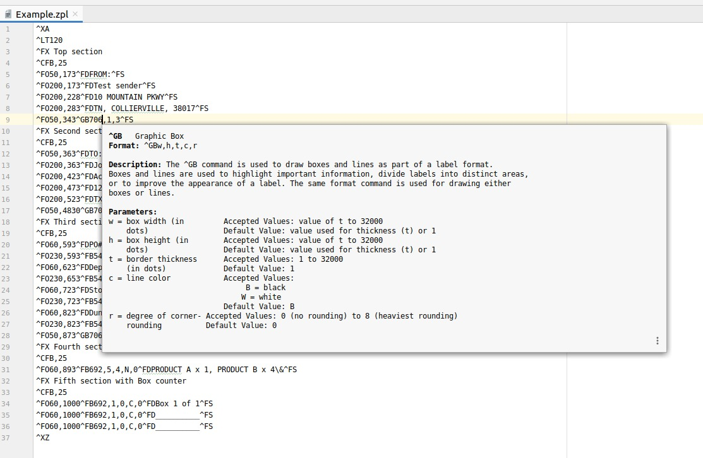

### ZPL Plugin

Adds basic functionality to deal with [ZPL language](https://en.wikipedia.org/wiki/Zebra_(programming_language)).

Currently it offers basic documentation for ZPL commands:

Main plugin [website](https://plugins.jetbrains.com/plugin/13958-zpl-plugin)
